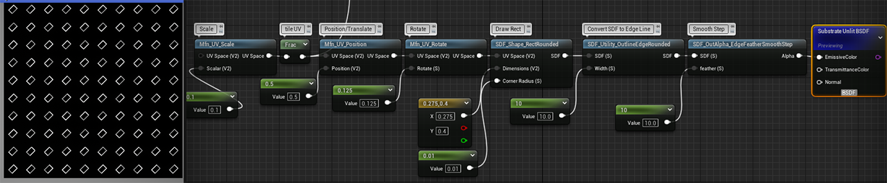
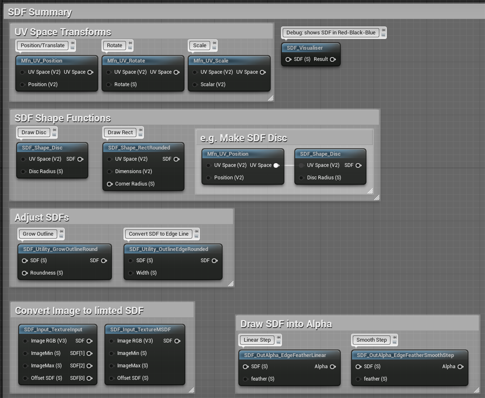
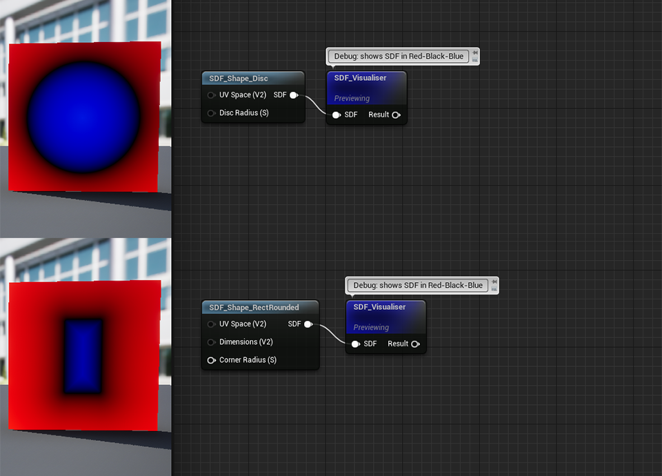
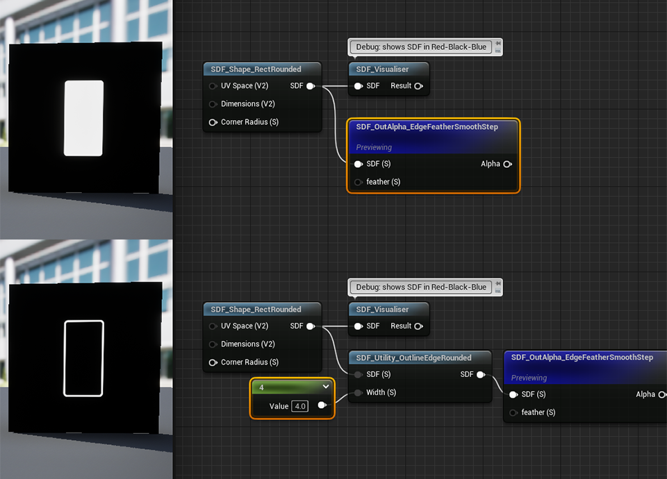
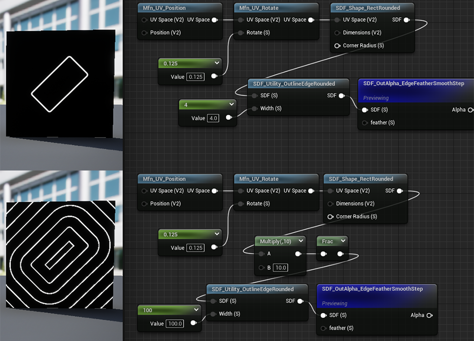
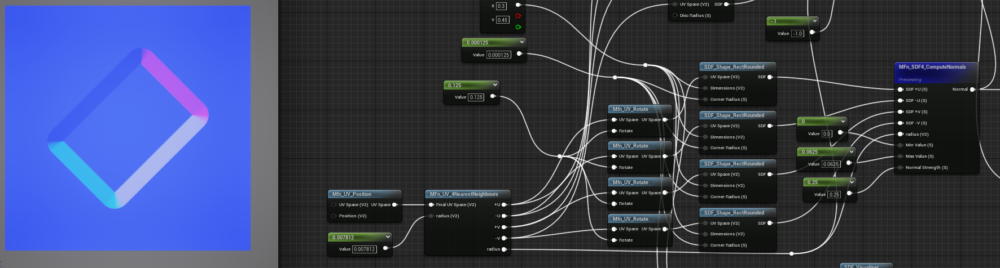
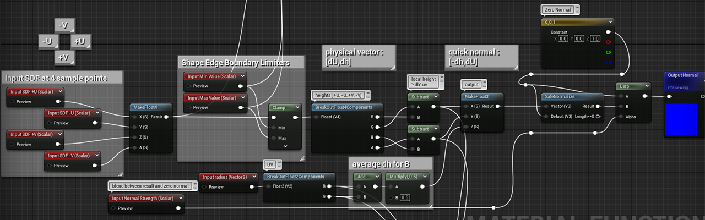
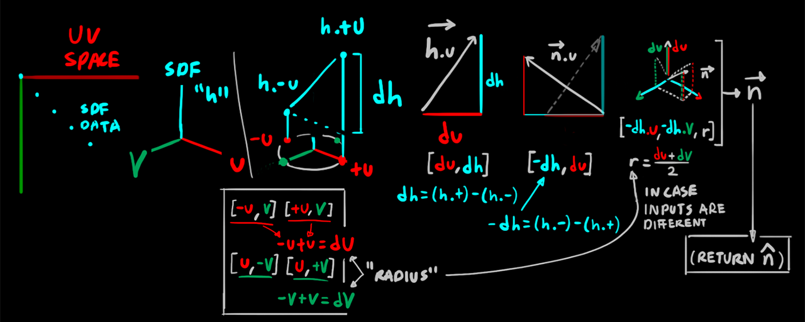
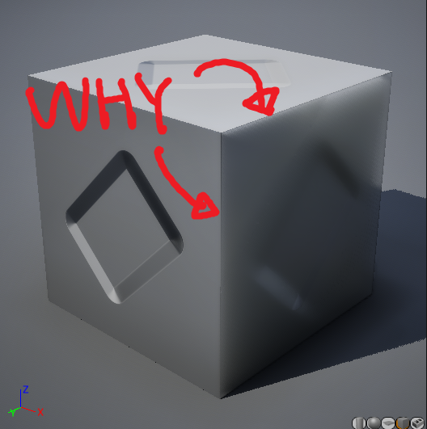

# Journal: SDF

resources:
- https://joyrok.com/SDFs-Part-Two
- https://www.artstation.com/blogs/briz/mnRN/2d-sdf-basic-shapes-and-visualization-material-function-library-ue5
- https://iquilezles.org/articles/distfunctions2d/
- https://www.youtube.com/watch?v=O_BwLOstG94
- https://alekongame.com/morph/

 
grouping of common subdivisions of functions

 
 
 

## SDF to Normal Field

 
SDF to simplistic Normal vector field

 
algorithm:
- get SDF values of 4 neighbours of center of sample point (+U, -U, +V, -V) offset by "radius"
	- shift the UV spaces by that much, so 4 copies of the SDF function is needed (unfortunately)
- clamp those values (lower value for inside of shape/edge, upper value for outside of shape/edge)
- maths:
	- get negative "height" differences `(-U.SDF) - (+U.SDF) = dh.U`, `(-V.SDF) - (+V.SDF) = dh.V` 
	- get sample "radius"
		- `+U-U = dU`, `+V-V = dV`
		- radius = average of `dU` and `dV`
		- in case both inputs are different, might simplify this since i can't think of actual use of different sampling widths between U and V
	- make `[-dH.U, -dh.V, radius]`, that's the quick and dirty normal
	- normalise and pass to normal input of shader

 

### potential issues:
- high `maxsampler count` (about 400)
- drawing an SDF shape function 4 more times to create the normal might make shader 5x as heavy, might be too much for complex compound SDF shapes

## outtakes

 
bad normal result due to improper UV transforms (SDF normal facing the wrong way)

 
XY value mis-map due to XY being of range `[0,1]` when UE requires `[-1,+1]` (blurry side-facing faces)
