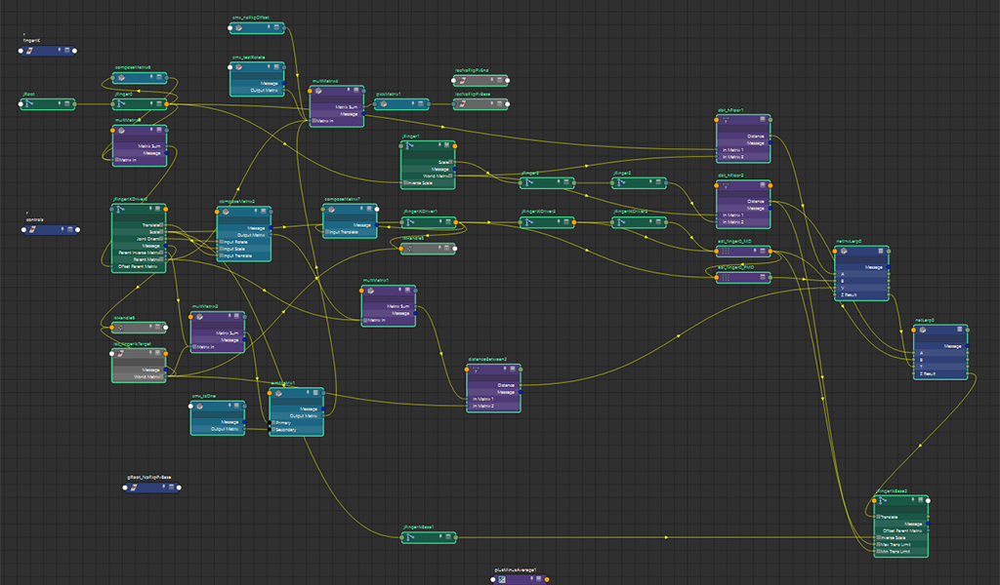

**UPDATE 2025: code has since been edited, a follow-up to this page will be written at a later date, to address `ikHandle`s and the proper invocations to create them, instead of lazy node spawning**

[https://github.com/STUAAAAAAAAAART/mayaNodeToPython](https://github.com/STUAAAAAAAAAART/mayaNodeToPython)

see also applied uses in my other repo about rigging modules/sections:<br/>
[https://github.com/STUAAAAAAAAAART/StuMayaRigToys](https://github.com/STUAAAAAAAAAART/StuMayaRigToys)

# Converting a selection of nodes in the maya node editor to python commands

**Problem**: writing python code to codify a node network takes a long time due to:
- having to look up the same documentation for the same core command over and over again for each invocation (muscle memory still isn't there yet; also code paranoia and oversimulation in my head)
- increased effort as number of nodes increase

**Goal**: writing python code to write python code

**Considerations and Future Improvements**:
- nodes with complex attributes like `blendMatrix`
  - in manual service, a new `target` has to be made in the attribute editor panel before connecting an attribute to it
- attributes with pre-assigned values instead of an incoming connection, especially `composeMatrix` and other maths and utility nodes (e.g. quick linear scalars)
  - for pre-calculated transforms: it's best to address this after the code printing step
- complex nodes, especially IK solvers and constraints
	- very especially the `message` attribute, will have to skip those
- code adjustment friendliness
  - input nodes/objects are held by a python `list`, so that i can reorder or rename a few things without having to worry too much about program flow or find-and-replace-and-sanityCheck, a step towards a peace of mind
- printing the output to a file
  - currently copying off the script editor, but large networks could easily flood the console with lots of text


## script

```py
import maya.cmds as mc
import maya.api.OpenMaya as om2

"""
playlist while coding:
	https://www.youtube.com/watch?v=smyqDlcHE14
	https://www.youtube.com/watch?v=1bEv74JrHQo
"""

# selection phase: get items
activeSelection = om2.MGlobal.getActiveSelectionList()
# [2022: NOT IN USE] convert shortName string from getSelectionStrings to longnames (just because)
# checkList = mc.ls(activeSelection.getSelectionStrings(), long=True) # -> list : ["longName", ... ]
	# line not in use because mc.listConnections() does not return longNames.
		# the flag to return longNames exist from 2023 onward

# detection phase: get all connections strictly within selection
checkList = activeSelection.getSelectionStrings() # -> list : ["shortName", ... ]

nodeList = []
addAttrList = []
connectionList = []
nodeCounter = 0
for node in checkList:
	# write createNode commands
	nodeList.append(f'nodeList[{nodeCounter}] = mc.createNode("{mc.nodeType(node)}", n="{node}", skipSelect = True)')

	# check for user-defined attributes and write addAttr commands
	checkAttrUD = mc.listAttr(node, userDefined=True)
		# WARNING: returns noneType if list is empty
	if checkAttrUD: # if not None, basically
		for attr in checkAttrUD:
			# query custom attr type
			checkAttrType = mc.attributeQuery(attr, n=node, attributeType = True)
			if checkAttrType in ["float","double","byte","short","long","char"]:
			# query attribute attributes (:shrug:)
				flagString = ""
				# default value
				flagString += f", defaultValue = {mc.attributeQuery(attr, n=node, listDefault = True)[0]}"
				# soft range (attribute sliders)
				if mc.attributeQuery(attr, n=node, softMinExists = True):
					flagString += f", hasSoftMinValue = True, "
					flagString += f", softMinValue = {mc.attributeQuery(attr, n=node, softMin = True)}"
				if mc.attributeQuery(attr, n=node, softMaxExists = True):
					flagString += f", hasSoftMaxValue = True, "
					flagString += f", softMaxValue = {mc.attributeQuery(attr, n=node, softMax = True)}"
				# hard range (hard limits)
				if mc.attributeQuery(attr, n=node, minExists = True):
					flagString += f", hasMinValue = True, "
					flagString += f", minValue = {mc.attributeQuery(attr, n=node, softMin = True)}"
				if mc.attributeQuery(attr, n=node, minExists = True):
					flagString += f", hasMaxValue = True, "
					flagString += f", maxValue = {mc.attributeQuery(attr, n=node, softMin = True)}"
				# hidden?
				holdBool = mc.attributeQuery(attr, n=node, hidden = True)
				flagString += f", hidden = {'True'*holdBool}{'False'*(not holdBool)}"
				# connection settings
				holdBool = mc.attributeQuery(attr, n=node, readable = True)
				flagString += f", readable = {'True'*holdBool}{'False'*(not holdBool)}"
				holdBool = mc.attributeQuery(attr, n=node, writable = True)
				flagString += f", writable = {'True'*holdBool}{'False'*(not holdBool)}"
				# animatable?
				holdBool = mc.attributeQuery(attr, n=node, keyable = True)
				flagString += f", keyable = {'True'*holdBool}{'False'*(not holdBool)}"

				# write attAttr command
				addAttrList.append( f'mc.addAttr("{node}", longName = "{attr}", attributeType = "{checkAttrType}" {flagString})')
			else:
				# complex attribute, manual consideration required for now
					# it should be surmountable within mc., but that's for another time as other utilities come
				# TODO: other types:
					# enum
						# listEnum = True 
					# compound
						# listChildren = True
						# listSiblings = True
				addAttrList.append(f'# "{checkAttrType}" type: {node}.{attr}')
			
	# query outgoing connections

	queryConnections = mc.listConnections(node, s=False, c=True,  d=True, p=True )  # -> list : ["shortName_from.attr", "shortName_to.attr", ... , ... ]
		# downstream command
	for i in range(int(len(queryConnections)*0.5)): # -> "shortName_from.attr"
		# note: script has been working with shortnames the whole time,
		# ensure node names are all consistently shortNames or longNames (and not a mix of both)
		if queryConnections[i+i+1].split('.')[0] in checkList: # <- "shortName_to.attr"
			# downstream node is in selection scope, append [input, output] to list
			holdIndex = checkList.index(queryConnections[i+i+1].split('.')[0])
			
			fromNode = 'f"{' + f"nodeList[{nodeCounter}]" + '}' + f'.{queryConnections[i+i  ].split(".")[1]}"'
			#           f"{      nodeList[      n      ]     }      .                         attribute     "
			# f"{nodeList[n]}.attribute"

			toNode   = 'f"{' + f"nodeList[{holdIndex  }]" + '}' + f'.{queryConnections[i+i+1].split(".")[1]}"'
			#           f"{      nodeList[      n      ]     }      .                         attribute     "			
			# f"{nodeList[n]}.attribute"


			
			# write connectAttr commands
			connectionList.append(f'mc.connectAttr({fromNode}, {toNode}) # {queryConnections[i+i]} -> {queryConnections[i+i+1]}')
			
	# next node
	nodeCounter += 1

# print phase: print all commands for creation and connections
# TODO: write text to file (honestly copying from the script editor will do for now)


print("\n# scripterStu: start print\n")

print("import maya.cmds as mc")
print("import maya.api.OpenMaya as om2\n")

print("activeSelection = om2.MGlobal.getActiveSelectionList()")

print("\n# create nodes\n")
print(f"nodeList = list(range({len(checkList)}))\n")

for printOut in nodeList:
	print(printOut)
print("\n# custom attributes\n")
for printOut in addAttrList:
	print(printOut)
print("\n# connect attributes\n")
for printOut in connectionList:
	print(printOut)

print(f"\n# scripterStu: print done\n")

```


the next step after getting the printout, would be to adjust the lines where specific nodes would be retreived from a selection and not created

so selecting these and running the script:



will result in the following output, which is most of the legwork done

## example output
```py
# scripterStu: start print

import maya.cmds as mc
import maya.api.OpenMaya as om2

activeSelection = om2.MGlobal.getActiveSelectionList()

# create nodes

nodeList = list(range(35))

nodeList[0] = mc.createNode("composeMatrix", n="cmx_noFlipOffset", skipSelect = True)
nodeList[1] = mc.createNode("composeMatrix", n="cmx_testRotate", skipSelect = True)
nodeList[2] = mc.createNode("multMatrix", n="multMatrix4", skipSelect = True)
nodeList[3] = mc.createNode("joint", n="jFinger0", skipSelect = True)
nodeList[4] = mc.createNode("joint", n="jRoot", skipSelect = True)
nodeList[5] = mc.createNode("composeMatrix", n="composeMatrix6", skipSelect = True)
nodeList[6] = mc.createNode("transform", n="locNoFlipPvEnd", skipSelect = True)
nodeList[7] = mc.createNode("pickMatrix", n="pickMatrix1", skipSelect = True)
nodeList[8] = mc.createNode("transform", n="locNoFlipPvBase", skipSelect = True)
nodeList[9] = mc.createNode("multMatrix", n="multMatrix3", skipSelect = True)
nodeList[10] = mc.createNode("joint", n="jFinger1", skipSelect = True)
nodeList[11] = mc.createNode("joint", n="jFinger3", skipSelect = True)
nodeList[12] = mc.createNode("joint", n="jFinger2", skipSelect = True)
nodeList[13] = mc.createNode("joint", n="jFingerIKDriver0", skipSelect = True)
nodeList[14] = mc.createNode("joint", n="jFingerIKDriver1", skipSelect = True)
nodeList[15] = mc.createNode("composeMatrix", n="composeMatrix3", skipSelect = True)
nodeList[16] = mc.createNode("distanceBetween", n="dbt_hFloor2", skipSelect = True)
nodeList[17] = mc.createNode("joint", n="jFingerIKDriver2", skipSelect = True)
nodeList[18] = mc.createNode("composeMatrix", n="composeMatrix7", skipSelect = True)
nodeList[19] = mc.createNode("joint", n="jFingerIKDriver3", skipSelect = True)
nodeList[20] = mc.createNode("distanceBetween", n="dbt_hFloor1", skipSelect = True)
nodeList[21] = mc.createNode("network", n="netInvLerp0", skipSelect = True)
nodeList[22] = mc.createNode("addDoubleLinear", n="adl_finger0_MD", skipSelect = True)
nodeList[23] = mc.createNode("ikHandle", n="ikHandle5", skipSelect = True)
nodeList[24] = mc.createNode("addDoubleLinear", n="adl_finger0_PMD", skipSelect = True)
nodeList[25] = mc.createNode("multMatrix", n="multMatrix1", skipSelect = True)
nodeList[26] = mc.createNode("multMatrix", n="multMatrix2", skipSelect = True)
nodeList[27] = mc.createNode("ikHandle", n="ikHandle6", skipSelect = True)
nodeList[28] = mc.createNode("network", n="netLerp0", skipSelect = True)
nodeList[29] = mc.createNode("transform", n="loc_fingerIkTarget", skipSelect = True)
nodeList[30] = mc.createNode("distanceBetween", n="distanceBetween2", skipSelect = True)
nodeList[31] = mc.createNode("aimMatrix", n="aimMatrix1", skipSelect = True)
nodeList[32] = mc.createNode("composeMatrix", n="cmx_tzOne", skipSelect = True)
nodeList[33] = mc.createNode("joint", n="jFingerIkBase2", skipSelect = True)
nodeList[34] = mc.createNode("joint", n="jFingerIkBase1", skipSelect = True)

# custom attributes

mc.addAttr("netInvLerp0", longName = "A", attributeType = "double" , defaultValue = 0.0, hidden = False, readable = True, writable = True, keyable = False)
mc.addAttr("netInvLerp0", longName = "B", attributeType = "double" , defaultValue = 0.0, hidden = False, readable = True, writable = True, keyable = False)
mc.addAttr("netInvLerp0", longName = "V", attributeType = "double" , defaultValue = 0.0, hidden = False, readable = True, writable = True, keyable = False)
mc.addAttr("netInvLerp0", longName = "zResult", attributeType = "double" , defaultValue = 0.0, hidden = False, readable = True, writable = True, keyable = False)
mc.addAttr("netLerp0", longName = "A", attributeType = "double" , defaultValue = 0.0, hidden = False, readable = True, writable = True, keyable = False)
mc.addAttr("netLerp0", longName = "B", attributeType = "double" , defaultValue = 0.0, hidden = False, readable = True, writable = True, keyable = False)
mc.addAttr("netLerp0", longName = "t", attributeType = "double" , defaultValue = 0.0, hidden = False, readable = True, writable = True, keyable = False)
mc.addAttr("netLerp0", longName = "zResult", attributeType = "double" , defaultValue = 0.0, hidden = False, readable = True, writable = True, keyable = False)

# connect attributes

mc.connectAttr(f"{nodeList[0]}.outputMatrix", f"{nodeList[2]}.matrixIn[0]") # cmx_noFlipOffset.outputMatrix -> multMatrix4.matrixIn[0]
mc.connectAttr(f"{nodeList[1]}.outputMatrix", f"{nodeList[2]}.matrixIn[1]") # cmx_testRotate.outputMatrix -> multMatrix4.matrixIn[1]
mc.connectAttr(f"{nodeList[2]}.matrixSum", f"{nodeList[7]}.inputMatrix") # multMatrix4.matrixSum -> pickMatrix1.inputMatrix
mc.connectAttr(f"{nodeList[3]}.scale", f"{nodeList[10]}.inverseScale") # jFinger0.scale -> jFinger1.inverseScale
mc.connectAttr(f"{nodeList[3]}.translate", f"{nodeList[5]}.inputTranslate") # jFinger0.translate -> composeMatrix6.inputTranslate
mc.connectAttr(f"{nodeList[3]}.parentMatrix", f"{nodeList[9]}.matrixIn[1]") # jFinger0.parentMatrix -> multMatrix3.matrixIn[1]
mc.connectAttr(f"{nodeList[3]}.worldMatrix", f"{nodeList[20]}.inMatrix1") # jFinger0.worldMatrix -> dbt_hFloor1.inMatrix1
mc.connectAttr(f"{nodeList[4]}.scale", f"{nodeList[3]}.inverseScale") # jRoot.scale -> jFinger0.inverseScale
mc.connectAttr(f"{nodeList[5]}.outputMatrix", f"{nodeList[9]}.matrixIn[0]") # composeMatrix6.outputMatrix -> multMatrix3.matrixIn[0]
mc.connectAttr(f"{nodeList[7]}.outputMatrix", f"{nodeList[8]}.offsetParentMatrix") # pickMatrix1.outputMatrix -> locNoFlipPvBase.offsetParentMatrix
mc.connectAttr(f"{nodeList[9]}.matrixSum", f"{nodeList[13]}.offsetParentMatrix") # multMatrix3.matrixSum -> jFingerIKDriver0.offsetParentMatrix
mc.connectAttr(f"{nodeList[10]}.scale", f"{nodeList[12]}.inverseScale") # jFinger1.scale -> jFinger2.inverseScale
mc.connectAttr(f"{nodeList[10]}.worldMatrix", f"{nodeList[20]}.inMatrix2") # jFinger1.worldMatrix -> dbt_hFloor1.inMatrix2
mc.connectAttr(f"{nodeList[10]}.worldMatrix", f"{nodeList[16]}.inMatrix1") # jFinger1.worldMatrix -> dbt_hFloor2.inMatrix1
mc.connectAttr(f"{nodeList[11]}.worldMatrix", f"{nodeList[16]}.inMatrix2") # jFinger3.worldMatrix -> dbt_hFloor2.inMatrix2
mc.connectAttr(f"{nodeList[12]}.scale", f"{nodeList[11]}.inverseScale") # jFinger2.scale -> jFinger3.inverseScale
mc.connectAttr(f"{nodeList[13]}.message", f"{nodeList[27]}.startJoint") # jFingerIKDriver0.message -> ikHandle6.startJoint
mc.connectAttr(f"{nodeList[13]}.parentMatrix", f"{nodeList[25]}.matrixIn[1]") # jFingerIKDriver0.parentMatrix -> multMatrix1.matrixIn[1]
mc.connectAttr(f"{nodeList[13]}.parentMatrix", f"{nodeList[2]}.matrixIn[3]") # jFingerIKDriver0.parentMatrix -> multMatrix4.matrixIn[3]
mc.connectAttr(f"{nodeList[13]}.translate", f"{nodeList[15]}.inputTranslate") # jFingerIKDriver0.translate -> composeMatrix3.inputTranslate
mc.connectAttr(f"{nodeList[13]}.scale", f"{nodeList[34]}.inverseScale") # jFingerIKDriver0.scale -> jFingerIkBase1.inverseScale
mc.connectAttr(f"{nodeList[13]}.scale", f"{nodeList[14]}.inverseScale") # jFingerIKDriver0.scale -> jFingerIKDriver1.inverseScale
mc.connectAttr(f"{nodeList[13]}.scale", f"{nodeList[15]}.inputScale") # jFingerIKDriver0.scale -> composeMatrix3.inputScale
mc.connectAttr(f"{nodeList[13]}.jointOrient", f"{nodeList[15]}.inputRotate") # jFingerIKDriver0.jointOrient -> composeMatrix3.inputRotate
mc.connectAttr(f"{nodeList[13]}.parentInverseMatrix", f"{nodeList[26]}.matrixIn[1]") # jFingerIKDriver0.parentInverseMatrix -> multMatrix2.matrixIn[1]
mc.connectAttr(f"{nodeList[14]}.message", f"{nodeList[23]}.startJoint") # jFingerIKDriver1.message -> ikHandle5.startJoint
mc.connectAttr(f"{nodeList[14]}.translate", f"{nodeList[18]}.inputTranslate") # jFingerIKDriver1.translate -> composeMatrix7.inputTranslate
mc.connectAttr(f"{nodeList[14]}.translateX", f"{nodeList[24]}.input1") # jFingerIKDriver1.translateX -> adl_finger0_PMD.input1
mc.connectAttr(f"{nodeList[14]}.scale", f"{nodeList[17]}.inverseScale") # jFingerIKDriver1.scale -> jFingerIKDriver2.inverseScale
mc.connectAttr(f"{nodeList[15]}.outputMatrix", f"{nodeList[25]}.matrixIn[0]") # composeMatrix3.outputMatrix -> multMatrix1.matrixIn[0]
mc.connectAttr(f"{nodeList[16]}.distance", f"{nodeList[28]}.A") # dbt_hFloor2.distance -> netLerp0.A
mc.connectAttr(f"{nodeList[16]}.distance", f"{nodeList[33]}.minTransXLimit") # dbt_hFloor2.distance -> jFingerIkBase2.minTransXLimit
mc.connectAttr(f"{nodeList[17]}.scale", f"{nodeList[19]}.inverseScale") # jFingerIKDriver2.scale -> jFingerIKDriver3.inverseScale
mc.connectAttr(f"{nodeList[17]}.translateX", f"{nodeList[22]}.input1") # jFingerIKDriver2.translateX -> adl_finger0_MD.input1
mc.connectAttr(f"{nodeList[19]}.translateX", f"{nodeList[22]}.input2") # jFingerIKDriver3.translateX -> adl_finger0_MD.input2
mc.connectAttr(f"{nodeList[20]}.distance", f"{nodeList[21]}.A") # dbt_hFloor1.distance -> netInvLerp0.A
mc.connectAttr(f"{nodeList[21]}.zResult", f"{nodeList[28]}.t") # netInvLerp0.zResult -> netLerp0.t
mc.connectAttr(f"{nodeList[22]}.output", f"{nodeList[28]}.B") # adl_finger0_MD.output -> netLerp0.B
mc.connectAttr(f"{nodeList[22]}.output", f"{nodeList[33]}.maxTransXLimit") # adl_finger0_MD.output -> jFingerIkBase2.maxTransXLimit
mc.connectAttr(f"{nodeList[22]}.output", f"{nodeList[24]}.input2") # adl_finger0_MD.output -> adl_finger0_PMD.input2
mc.connectAttr(f"{nodeList[24]}.output", f"{nodeList[21]}.B") # adl_finger0_PMD.output -> netInvLerp0.B
mc.connectAttr(f"{nodeList[25]}.matrixSum", f"{nodeList[30]}.inMatrix1") # multMatrix1.matrixSum -> distanceBetween2.inMatrix1
mc.connectAttr(f"{nodeList[26]}.matrixSum", f"{nodeList[31]}.primaryTargetMatrix") # multMatrix2.matrixSum -> aimMatrix1.primaryTargetMatrix
mc.connectAttr(f"{nodeList[28]}.zResult", f"{nodeList[33]}.translateX") # netLerp0.zResult -> jFingerIkBase2.translateX
mc.connectAttr(f"{nodeList[29]}.worldMatrix", f"{nodeList[23]}.offsetParentMatrix") # loc_fingerIkTarget.worldMatrix -> ikHandle5.offsetParentMatrix
mc.connectAttr(f"{nodeList[29]}.worldMatrix", f"{nodeList[27]}.offsetParentMatrix") # loc_fingerIkTarget.worldMatrix -> ikHandle6.offsetParentMatrix
mc.connectAttr(f"{nodeList[29]}.worldMatrix", f"{nodeList[30]}.inMatrix2") # loc_fingerIkTarget.worldMatrix -> distanceBetween2.inMatrix2
mc.connectAttr(f"{nodeList[29]}.worldMatrix", f"{nodeList[26]}.matrixIn[0]") # loc_fingerIkTarget.worldMatrix -> multMatrix2.matrixIn[0]
mc.connectAttr(f"{nodeList[30]}.distance", f"{nodeList[21]}.V") # distanceBetween2.distance -> netInvLerp0.V
mc.connectAttr(f"{nodeList[31]}.outputMatrix", f"{nodeList[2]}.matrixIn[2]") # aimMatrix1.outputMatrix -> multMatrix4.matrixIn[2]
mc.connectAttr(f"{nodeList[32]}.outputMatrix", f"{nodeList[31]}.secondaryTargetMatrix") # cmx_tzOne.outputMatrix -> aimMatrix1.secondaryTargetMatrix
mc.connectAttr(f"{nodeList[34]}.scale", f"{nodeList[33]}.inverseScale") # jFingerIkBase1.scale -> jFingerIkBase2.inverseScale

# scripterStu: print done

```

looks really daunting to type out by hand in hindsight...