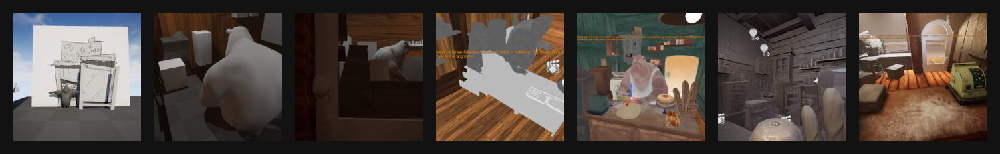

# 2024!

... and a bit of 2023 after graduation

> 
> **Rigging Reel 2023** 
> Spinosaurus Rig, Phoneme-based mouth rig 
> Autodesk Maya, Python 
> [⬅ rig reel](landing_RigReel2023.md) 

> 
> **Major Project: "Croissoink"** 
> Short Film by Emma Moisuc, Lucia Cisneros, Stuart Lim 
>  
> Environment and Prop Models (Autodesk Maya, Adobe Illustrator) 
> UE5 Generalist (scene and sequencer management and export, particle effects) 
> [Vimeo 📄](https://vimeo.com/832082284) 
> [⬅ stuart's project reel](landing_Croissoink.md) 

> 
> **stuart learns to rig via python openMaya 2.0** 
> Autodesk Maya, Python  
> [⬅ video and writeup](Overthinking%20FK%20Controllers/) 