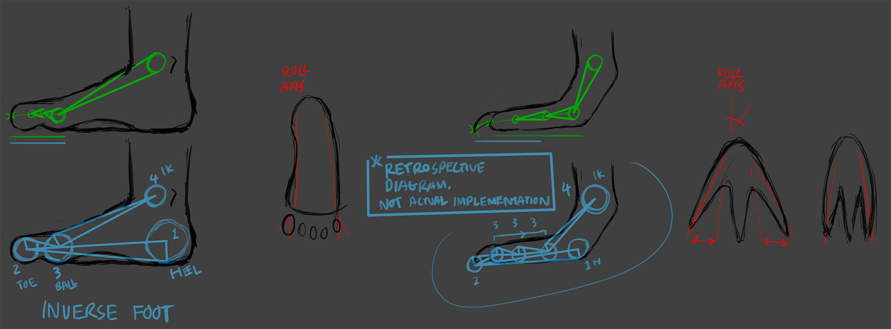
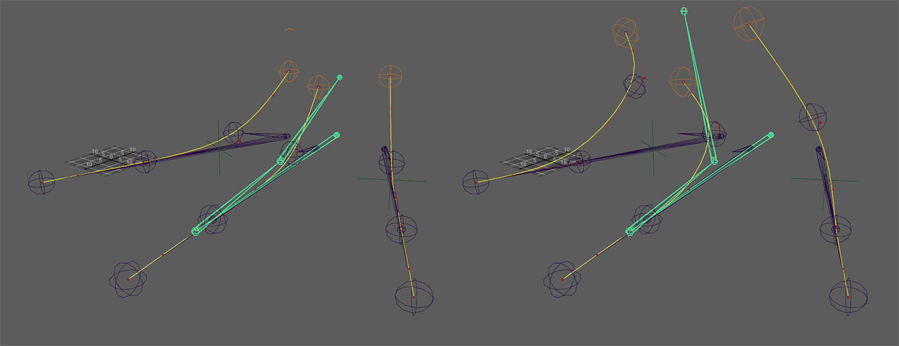
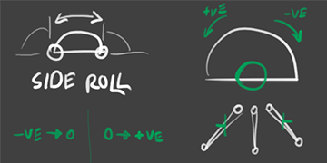
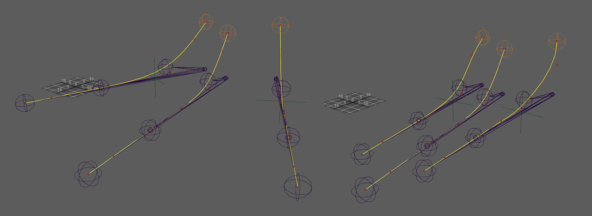
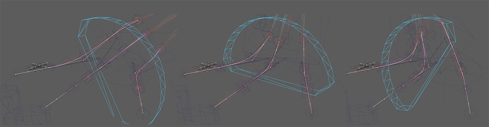
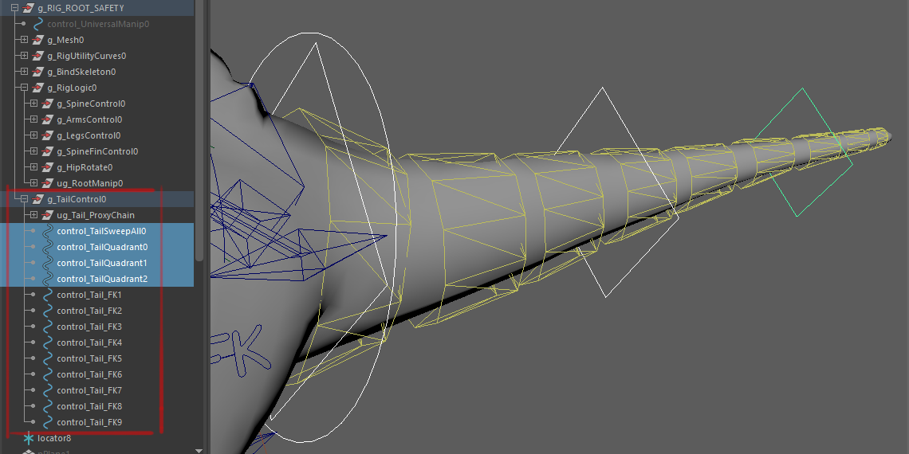
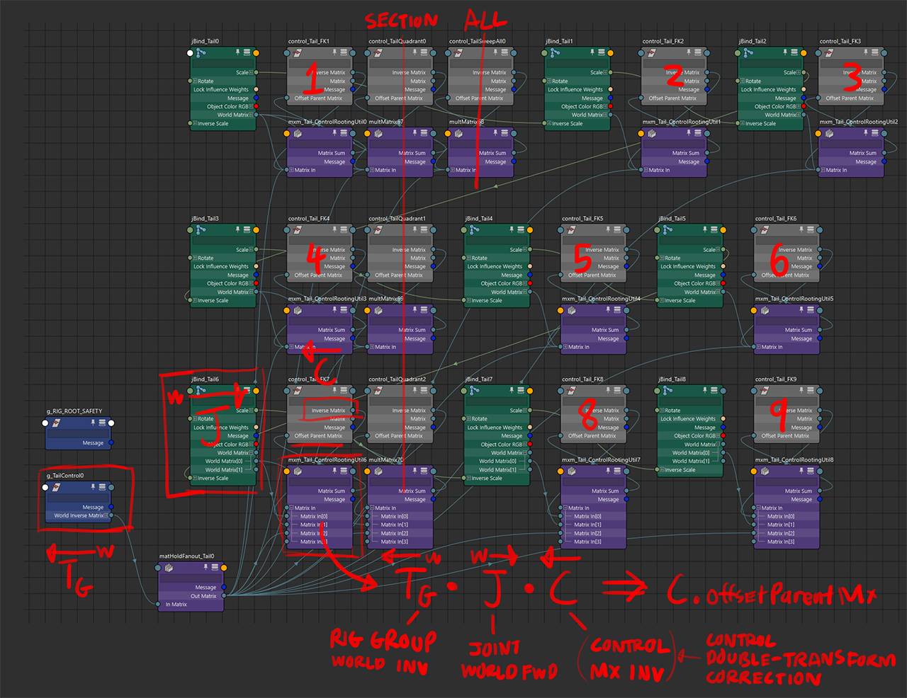
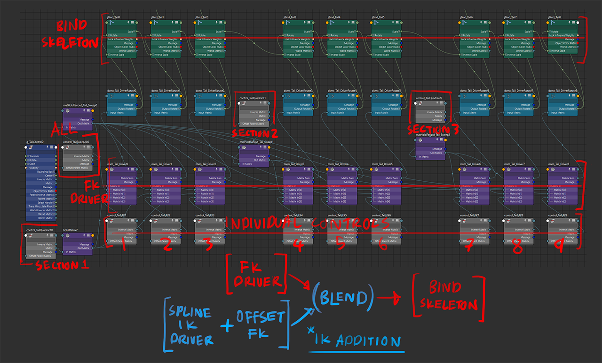
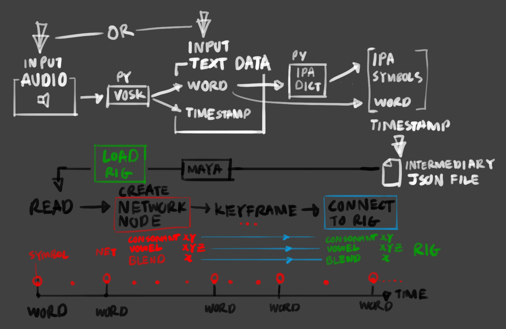
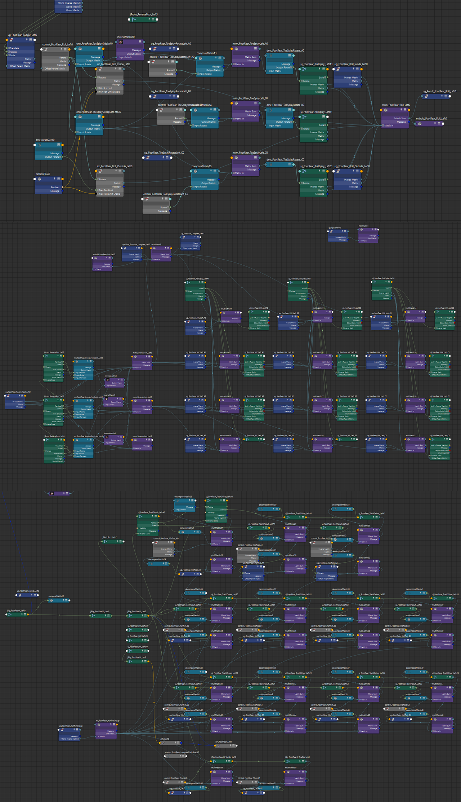

**explainer the video.md** 
# Youtube: Stuart's uni rigging demoreel 2023

<iframe width="560" height="315" src="https://www.youtube.com/embed/1oNCjAQye0Q" title="YouTube video player" frameborder="0" allow="accelerometer; autoplay; clipboard-write; encrypted-media; gyroscope; picture-in-picture; web-share" referrerpolicy="strict-origin-when-cross-origin" allowfullscreen></iframe>

## part 1: project spino

Part of Rigging Masterclass 2022/23, Bournemouth University  
Spinosaurus Model provided by Frontier Studios via Bounremouth University

### the foot

one of the main challenges in producing a rig for a spinosaurus (as described by Frontiera1) was solving the digitigrade foot ("finger-walker"a2).

> a1 part of talk by Frontier Studios rigging team at BFX 2022 hosted by Bournemouth University  
> a2 https://en.wikipedia.org/wiki/Digitigrade

an IK rig for a typical human foot involves side-roll and an inverse-foot IK solver, with the toes ("fingers") located at the tip of the foot. with

with the spinosaurus, the claw/toe is the main contact surface of the foot, which makes the inverse-foot system inadequate, as the toes need flexibility to articulate

differences in theory between rigging a human foot and a spino foot 

the method described by the talk abovea1 is using spline IKs to set each toe up for driving, and using the inverse foot to deform the spline drivers. one of the recommendations were the need to plant the toes to the floor as the foot rolls to the sides, possibly for leaning posts and movements, like run cycles where the spinosaurus is steering its stride to a different direction.

a shadow joint chain copy of each toe was made, all of which are rooted to a seperate joint located under the joint at the highest position of each toe. this shadow toes are then deforming the curve of the spline IK system representing the toes
 
foot spline IK curve deformer fork

to accommodate a variable sideways foot roll to that operation, an offset by a rotation centered along each side of the foot rotates the toe chain affected by the roll (i.e. the left edge rolls the left toe, the right edge rolls the right toe). the other toes unaffected by the toe are left alone to allow the foot to be planted on the floor, and any offsets are done by the prior splay transforms at any time.

 
foot spline IK sideways roll diagram

the pivots of the sideways foot roll are also affected by the splay of the toes at the side, so that the roll are always relative to the edges of the foot, even when expanded

 
 
foot spline IK splay and roll
 

### the tail

⬅ [see also: FK controller scripting video](<Overthinking FK Controllers>)

there was a suggestion to have additional controls to drive groups of multiple sections of the tail. for a 9-joint chain, each has an individual rotational FK controller; 3 additional controllers drive joints in that chan in consecutive groups of 3; a final overall controller drives all of them.

each joint is driven by adding the rotations together, with the node network ensuring the controllers still face the direction of the joint.

### postmortem and the rest

the biggest challenge for me during this 3-month long project is balancing between developing the most complex part of the rig, and enumerating the rest of the rig. the pressure of this has got me looking into possibly scripting most of the common nodework and tasks to a script native to maya. hopefully this would reclaim more time spent on addressing complexity away from enumerating the rest of the rig. 

⬅ github: [rigStu](https://github.com/STUAAAAAAAAAART/rigStu), still a work in progress

as for the spino rig itself, other anatomical considerations include its sail spine: while most known skeletons describe individual "sail bones" to be fused to the corresponding spinal section, animation consideration has to be made to have them articulate sideways for presentation purposes (also to consider if each spine should be segmented to articulate in a curve)

additionally there is the joint chain for the tongue, which could be a control scheme similar to the tail, or one with an additional spline IK switch to it.

other improvements that are either needed, or to expand functionality:
- individually blend the IK affector away from each toe while in IK mode (e.g. one toe in FK, other two in IK), so that the toes would stay curled in pose and not move as the IK control is moved far away from the driven foot 
	- not sure if this is a possible scenario in animation, but if it crops up, the FK/IK blending system needs to be more grandular
- adjust the transform logic of the reverse foot system, so that the tip-of-toe point and the "ball-of-foot" point would better represent the upward peel of the foot
	- it's currently placed a bit too high, and the end of the toes are affected by the rotation of the peel too early
-  figure out a proxy mesh arrangement (a reduced model that's seperated according to joint location) to quickly make a preview model in lieu of a complete skinned mesh
	- it's currently parented to a copy skeleton without much regard of the outliner, and it's one of the things i've yet to create a workflow for

## part 2: untitled project to generate keyframes for speech animation

⬅ script repository: [github/Uni_IPAkeyframeProject](https://github.com/STUAAAAAAAAAART/Uni_IPAkeyframeProject) 
attributions in github repository

### the rig (2021-2023)

the scope of the rig was constrained to the mouth, without the rest of the emotive face. driven joints for

the rig was structured around the International Phonetic Alphabet, which describes the possible sounds a human vocal system can produce. the idea of using phonemes instead of viscemes is to provision to recieve other languages for speech animation

the driven face is condensed to the following controls:

- consonant space (2 floats, place and jaw rotation)
	- place of articulation for where the tongue would be placed for consonants made via oral obstruction
	- jaw rotation, simply lowering the law while maintaining place 

- vowel space (3 floats)
	- place of articulation, this time to complement the "backness" of the vowel
	- jaw rotation, independent to the consonant jaw, just for the sake of separation of representation between consonant-vowel transition
	- mouth roundness, the "aperture size" of the lips

- consonant-vowel blend (1 float)
	- blending over controls between 

the controls drive the rig face, which consist of:

- a guide spline for the tongue
	- applied as a spline IK to the tongue chain, 
- two spline tracks, outlining:
	- the roof of the inner mouth, for consonant places
	- the lower articulation extents of the tongue, for vowel-backness
- vowel lip roundedness
	- ring of joint points representing the lips are distributed along a lofted surface of 3 sets of curves, representing the extents of vowel roundedness
- jaw rotation, a conversion from linear float value to an angular value

### the script (2022-2023)

in short:

0. [python/VOSK - OS]  audio is converted to a JSON file, containing detected words and timestamp of occurence
1. [python/IPA-Dict.json - OS]  words are convered to an IPA definition through a dictionary lookup
2. [python - maya]  file is read into  IPA symbols are convered to mouth articulation definitions, and keyframed consecutively between word timestamps

the IPA definitions have been taken from the IPA-Dict projectb1, to serve as the basis of conversions from words to IPA. the project contains a few variants of certain languages to represent regional accents, especially when a word has differing accepted pronounciations by different peoples

> b1 https://github.com/open-dict-data/ipa-dict

the scope of this project is limited to the EN-GB definitions, but the only variance in choosing a different locale is pointing to another definition file. also this is to reflect the intent of the keyframer only accepting IPA, so that it's mostly language-agnostic as long as there is an IPA definition or transcription. this would also allow for new trends in the language to be added to the lookup dictionary as needed (e.g. "bruh", "simp", "yeet", "sus", "rizz"...)

one current overall limitation of the implementation is of how dental and bilabial stops are represented, as they require more than a default mouth-closed resting pose:

- bilabial stops (Buh) dam air in the mouth by bursing lips, and the strength of enounciation (e.g. shouting) would change the shape of the lips and cheeks (along with jaw articulation) a litte more as it's holding a lot more air back
- dental plosives (Tuh) parses air through the tongue resting slightly at the back of the tips of the front teeth. stronger enounciations (**TH**ICC) would show more of the upper row of teeth by raising the upper lip, and in certain pronounciations show more of the tongue by resting the teeth on a bit of the front of the tongue
- labiodental fricatives (Fuh) parses air through the lower lip resting on the tips of the upper row of teeth, by rolling or raising the lower lip above the lower row of teeth. along with the lip requirement, the tongue is at rest, which makes both an edge case of the consonant control in the rig, as the tongue setup requires a place along the top of the mouth.

> b2 https://en.wikipedia.org/wiki/Consonant 
> b2 https://en.wikipedia.org/wiki/Plosive

the other is of complex consonants (like click consonants), which would require representation by an animation, rather than a pose or position.

### postmortem

the result animation didn't always read correctly for a given stretch of audio, mostly due to the pose values set for the required phonemes (along with the aforementioned limitations of the rig)

adjustments to the project also include:

- properly implement bilabial (lips) and labiodental (lip-and-jaw) stops mentioned above
- make network nodes hold values to represent the various phonemes
	- script will still generate most timing, but symbol-to-value representation would be stored in the rig rather than relying on an external file (an external file would still be feasible, probably for purposes of syncing or external editing or transfer)
- need to device a proper way of editing word spacing/timing/stretch in maya for fine tuning purposes, also to adjust for stretched-out words
- add the following controls to abstract or adjust multiple driven actions:
	- loudness: scaling poses for larger mouth shapes, to help with shouting moments 
	- sideways rotation offset to jaw-lowering: for sideways-mouth moments, e.g. whispering

and all of the above while making a blend for facial expression controls, so the speech animation can be layered/blended upon an existing expression

this project is not unique in any way: existing speech animation tools exist, including a toolset within Advanced Skeleton that converts audio to keyframe animationc1. I kinda saw it as an interesting topic at the time and tried to figure out as much as i could on my own, and i'm now curious on the process of implementing this project natively in unreal engine blueprints and base character rigs

> c1 LipSync example voice & Unreal export - Advanced Skeleton https://www.youtube.com/watch?v=73y3aJuScaY  

## part 3: "Rigging Script Test"
### [⬅ see explainer in Overthinking FK Controllers](<./Overthinking FK Controllers>)

github: [rigStu](https://github.com/STUAAAAAAAAAART/rigStu)

but in short: it's me figuring out how does openMaya 2.0 (python) work, and how i could use it for scripting work, like node creation and networking, and rigging operations. this test is to apply a simple FK controller to every single joint in active selection.

after this it's on to adding more core functions to break down and describe the construction of more complex rigs

---

because this is probably only worth manually doing once
