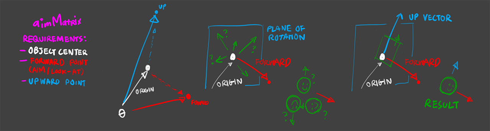
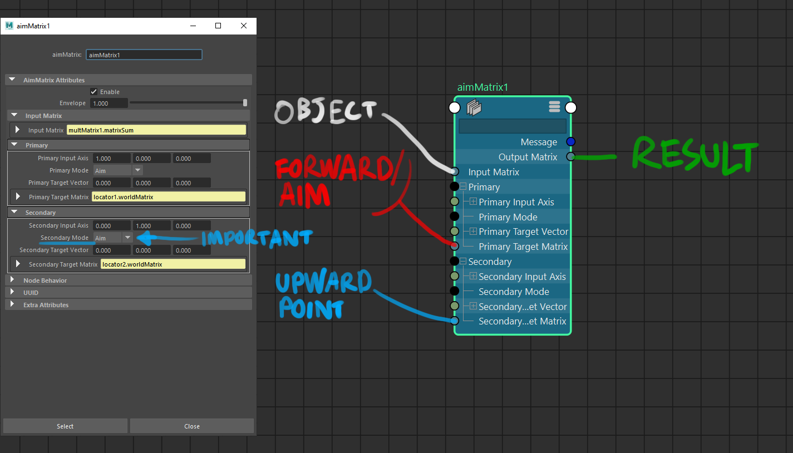

# aimMatrix Node

https://help.autodesk.com/view/MAYAUL/2020/ENU/?guid=__Nodes_aimMatrix_html

https://help.autodesk.com/view/MAYAUL/2024/ENU/?guid=GUID-B290C3E6-95BC-4299-BC0D-169EADDE6319
> **Aim mode**: the Target vector is treated like a 3D point in the Target matrix.  
> **Align mode**: the Target vector is treated like a vector in the Target matrix. In this mode, you must specify a valid (0,0,0 is not valid).

earliest known version: 2020

 
