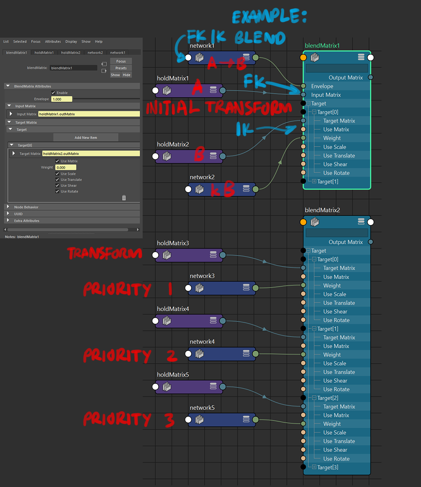
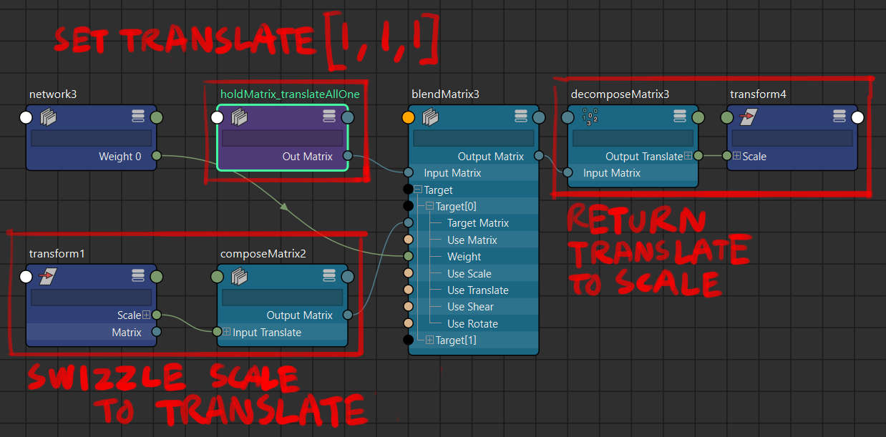
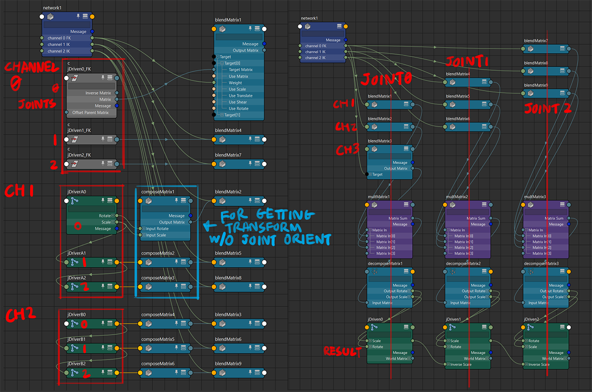

# blendMatrix Node <br/> transform scaling and matrix mixer

https://help.autodesk.com/cloudhelp/2020/ENU/Maya-Tech-Docs/Nodes/blendMatrix.html

earliest known version: 2020(? according to https://mayamel.tiddlyspot.com/)

### intended use case



### if there are multiple targets, the `targetMatrix` blends takes priority of the latest index. 

```
inputTransform: A
targets: B,C,D,E,F,G

weight:  0,0,0,0,0,0
result transform: A

weight:  0,1,0,0,0,0
result transform: C

weight:  2,0,0,0,0,0
result transform: 2B

weight:  0,0,0,1,1,0
result transform: F, F only.

weight:  5,4,3,2,1,0
result transform: still just F
```

> ## note on `translate` component of the transform:
> **when a `translate` exists with a `rotate` and `scale`** in the transform matrix, **the translate blending would follow the path affected by the rotation and scale transforms**.
>
> depending on use case / if not desired, the way to avoid this is to **pick the `translate` part of the transform** (either in the `blendMatrix` node itself for the `targetMatrix`, or using `pickMatrix` before connecting to the `blendMatrix` node) and **evaluate those separately in another `blendMatrix` before recombination**.
>
>it's less of an issue for rotation-only joints and animation baking/export, but **it may be of concern if any object/system needs blending with transforms involving translation**. the componentwise results are to be accumulated either with `composeMatrix` or as a translate-rotate-scale multiplication with `multMatrix`

> ## note on `scale` component of the transform:
>
> when weight is `k`, the input scale is `A` and the target scale is `B`, **the result scale value is `k(A-B)+A`, which is the difference in `scale` values that is being (`k`)scaled up**.
>
> also a **negative scale result for the scale component (except scale.z) induces a flip in rotation <u>due to matrix maths</u>**. consider clamping the minimum values leading to the weight attributes
>
> **if it is an absolute must for negative scale to persist**, this is one workaround:<br/>
> <br/>
> **Maya 2024 continuity**: or use 3 `lerp` nodes for `scale.xyz`, don't forget to set `input1` as `1`

<br/> ------------------------------------------------------------------------------------------------

### multiple-channel transform blending mixer

<br/>
> note 1: the inputMatrix of the blendMatrix nodes in this case is `identity`<br/>
> note 2: image demonstration is just for the rotation component, the quirks of the scale component is described above

this method makes **multiple transform sets (channels)** behaves like an volume fader row on an audio mixer, **where each result's weight can be adjusted independently of each other**.


a simple FK/IK blend wouldn't require a multiple-channel setup, however **if the result transforms require weights above 1**, the multiple-channel setup would be required, as **the envelope attribute does not scale the `inputMatrix` transform up if it goes above 1**

also if scaling the **individual components** of the transform is desired (i.e. weigh translate, rotate, scale separately), or if a **blend between three or more transforms** is desired, **the mixer method is the only way to do so**, because as mentioned in the intended use case above: **the priority behaviour of the blendMatrix** do not allow for mixing between targets directly, especially if the components are fed into different `targetMatrix` channels.

## multiple blendMatrix nodes multiplied together<br/> vs single blendMatrix chain of multiple matrices

⬇ open GIFs in a new tab for original size (1024px)

<br/>
⬆ default hopping behaviour - `translate` component only<br/>
<br/>
⬆ default hopping behaviour - `rotate` component only<br/>
red🟥 shape: **single** `blendMatrix`; teal🟦 shape: multiple `blendMatrix`

> the blending behaviour from the intended use case 🟥 of `blendMatrix` (i.e. all target matrices fall into a single `blendMatrix` node) does not seem to be consistent, especially on blends going backward from a later index to an earlier index ( (`n`)th to (`n-2`)th or earlier), **exhibiting a hopping motion from blending to all-zero first**

having **multiple blends** 🟦 for transform resizing reasons increases node counts, but **allows for blending towards all-zero**.<br/>
this also allows a quick scaling of the rotation component <u>without contending with maya's rotation value interventions</u> (the `unitConversion` node thing that happens when the environment is set in `degrees` if a `floatAngle` is connected to any `attribute` of dissimilar kinds). 

## scale and translate component scaling<br/> blendMatrix vs multiplyDivide<br/> and lerps vs scalars


`blendMatrix`:
- scale is 1 at zero-weight (or equalling at a weight where inputMatrix.scale = targetMatrix.scale)
- **scale introduces a flip in rotation if result scale goes below 0**

`multiplyDivide`:
- **scale is 0 at zero-weight (scalar is 0), making the result transform 0 and is unsuitable for mixing purposes as zero-weight would cause models or joints to disappear**

## blendMatrix vs passMatrix<br/> (for transform resizing purposes)

`passMatrix` multiplies all the `elements in the matrix` by a `scalar`. unfortunately that also means the `W` component of the matrix is also scaled up. this negates the scalar operation, so resetting the `W` component to identity would be required if `passMatrix` is to be used.

## blendMatrix vs wtAddMatrix

`wtAddMatrix` quirks(? or aspects making it unweildy to use?):
- **the `rotation` snaps to the nearest weighted matrix when brought above all-zero, and does not blend to all-zero from any weight for some reason**
- the `translate` and `scale` components blend correctly towards all-zero, but note that **`scale` goes to 0 at zero-weight due to its linear nature**
- `wtAddMatrix` does not have the ability to pick transform components unlike in `blendMatrix` targets

## [Maya 2024] lerp node

while only affecting a single float attribute, **three `lerp` nodes each could be a replacement for doing `scale` component adjustments to a transform without contending with rotation flips** mentioned above.

if a vectorLerp (basically lerping between 3 floats at once) exists that'd be great (there's `blendColors`, but the blend factor doesn't go beyond `0-1`)

## misc notes

- `quatSlerp` vs `weightMatrix`?
	- `quatSlerp` is initialised with each inputs at `[0,0,0,0]`, which causes problems when converting back to euler angles via quatToEuler. a zero quaternion `[0,0,0,1]` is expected for the lerp to work
	- the results of both are identical, and `weightMatrix` tend to have a simpler setup without having to pre-adjust attributes