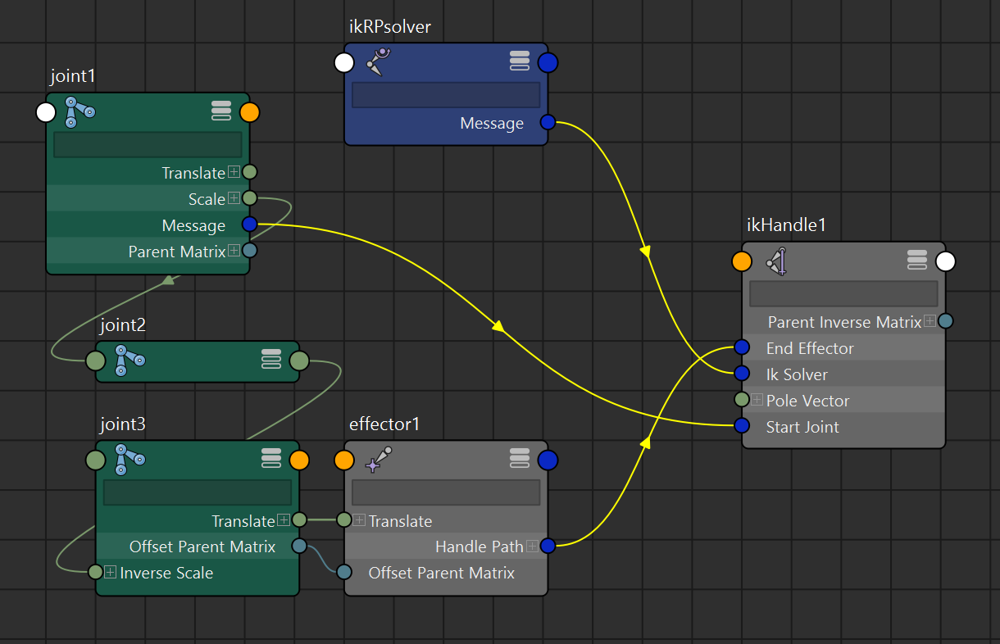
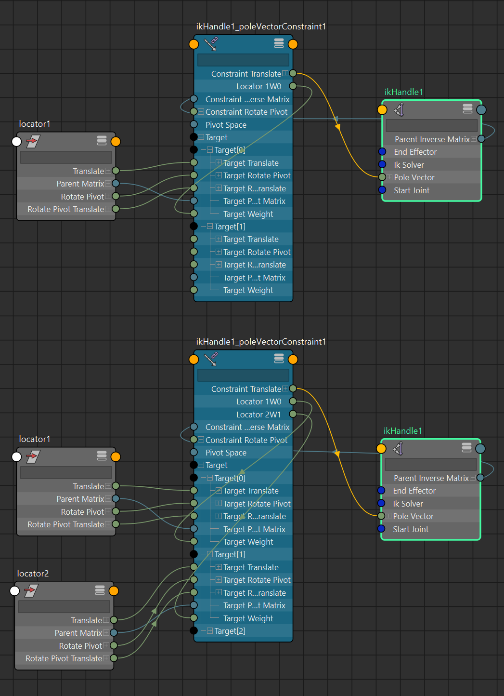

# ikHandle and ikEffector

https://download.autodesk.com/us/maya/2010help/CommandsPython/ikHandle.html <br/>
https://help.autodesk.com/cloudhelp/2020/ENU/Maya-Tech-Docs/CommandsPython/ikHandle.html

earliest known version: ? (probably pretty early on)

> If there are 2 joints selected and neither -startJoint nor -endEffector flags are not specified, then the handle will be created from the selected joints.
> 
> If a single joint is selected and neither -startJoint nor -endEffector flags are specified, then the handle will be created with the selected joint as the end-effector and the start joint will be the top of the joint chain containing the end effector.



just out of curiosity, i've manually recreated the node graph that would result from using the ikHandle command, but oddly that didn't function like it should. i haven't figured out the extra steps to make it work, so i don't have the answer to making it purely using `mc.createnode()` and connecting attributes

## pole vector constraints

https://download.autodesk.com/us/maya/2010help/commandspython/poleVectorConstraint.html <br/>
https://help.autodesk.com/cloudhelp/2020/ENU/Maya-Tech-Docs/CommandsPython/show.html?poleVectorConstraint.html&cat=Animation



by default through the `mc.poleVectorConstraint` command, a `poleVectorConstraint` node is created if the `ikHandle` does not have an upstream connection to one. check the [scripting](#scripting) section for more detail on the function

> it's possible to manually enumerate the nodes in this case, but the `mc.polevectorConstraint` command honestly does a good job of looking for the right nodes to adjust, so it usually worth using it rather than doing it through `mc.createNode` and plugging it accordingly.
>
> keep in mind **`mc.poleVectorConstraint` doesn't return the appropriate attributes to the target** (i.e `poleVectorConstraint."Locator 1W0"` and/or `poleVectorConstraint.Target[0].targetWeight` for the `locator1` target transform), so a function to find that connection to those `attribute`s would be needed to connect them from a controller DAGobject/node elsewhere

### multiple pole vector targets
if there is one and the command is invoked on another pole vector target, the associated `poleVectorConstraint` node will be adjusted instead of creating a new one. multiple pole vector targets will be blended together according to the weights


## IK solver type

``` py
import maya.cmds as mc
mc.ikHandle(sol = "ikRPsolver")
```

the function defaults to the rotating plane solver, but any other solver types has to be specified

> The complete list of available solvers may not be known until run-time because some of the solvers may be implemented as plug-ins.
>
> Currently the only valid solver are `ikRPsolver` , `ikSCsolver` and `ikSplineSolver`.

## scripting

for automating: create a variable and assign the output of `mc.ikHandle()`. this should get the DAG namespace selection string in the maya scene/outliner

```py
import maya.cmds as mc
import maya.api.OpenMaya as om2

# scene should contain:
# joint chain | joint1 -> joint2 -> joint3
# locators    | locator1 locator2

# mc.ikHandle() does not have a skipSelect flag unlike mc.createNode(ss=True),
	# so probably hold the existing scene selection thing before executing

holdSelection = om2.MGlobal.getActiveSelectionList() # skip selection alternative
print(holdSelection.getSelectionStrings())
#>> whatever's currently selected in the scene

# ----- 

# new IK handle
newHandle = mc.ikHandle(sj='joint1', ee='joint3')
mc.select(holdSelection.getSelectionStrings()) # skip selection alternative
print(newHandle)
#>> ['ikHandle1', 'effector1']
#!!!! note that the effector is a child of
	# the specified ee joint in the ikHandle(ee='') function

# ----- 

# pole vector constraints
newConstrain = mc.poleVectorConstraint('locator1', newHandle[0]) # <- 'locator1', 'ikHandle1'
print(newConstrain)
#>> ['ikHandle1_poleVectorConstraint1']
# no changes made to current selection

# adding another pole vector target to the same ikHandle
# pretty much the same syntax, maya will know where's the node to adjust and plug
addConstrain = mc.poleVectorConstraint('locator2', newHandle[0]) # <- 'locator2', 'ikHandle1'
print(addConstrain)
#>> ['ikHandle1_poleVectorConstraint1']
# mc.poleVectorConstraint() will always
# 	return the affected or created pole vector constraint,
#	so a pre-check for an existing poleVectorConstraint node
# 	isn't necessary

# removing a pole vector constraint target:
deleteConstrain = mc.poleVectorConstraint('locator1', newHandle[0], e=True, rm=True ) # <- 'locator1', 'ikHandle1', edit = true, remove = true
# the function does a re-index on connections from the other targets 
# 	if a target not at the end of the list is removed 
print(deleteConstrain)
#>> ['ikHandle1_poleVectorConstraint1']
# still returns affected poleVectorConstraint node

# -----

# parse selection strings into om2.MSelectionList pointers to the created nodes
newList = om2.MSelectionList()
newList.add(newHandle) # <- ['ikHandle1', 'effector1']
newList.add(newConstrain) # <- ['ikHandle1_poleVectorConstraint1']

# -----

```