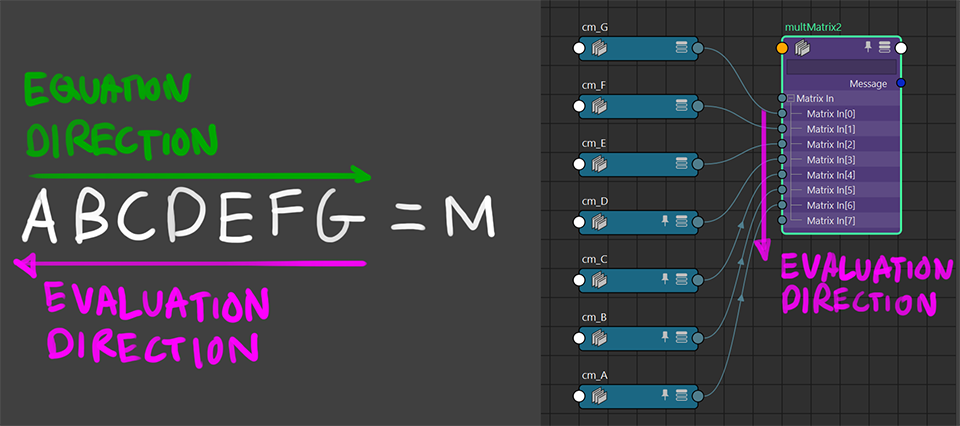
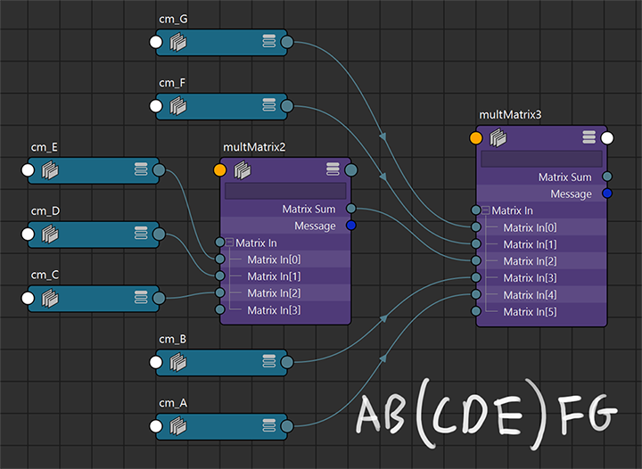

# multMatrix Node

https://download.autodesk.com/global/docs/maya2013/ja_jp/Nodes/multMatrix.html

earliest known version: 2013(? according to https://mayamel.tiddlyspot.com/)

- ["In Video Games, The Player Never Moves (Matrix Math Explained Like This)" - youtube @JoshsHandle](https://youtu.be/wiYTxjJjfxs)  
timestamps: [12:37](https://youtu.be/wiYTxjJjfxs?t=757), [17:51](https://youtu.be/wiYTxjJjfxs?t=1071)
- https://en.wikipedia.org/wiki/Matrix_multiplication#Non-commutativity

 

