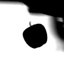
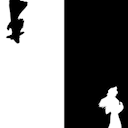
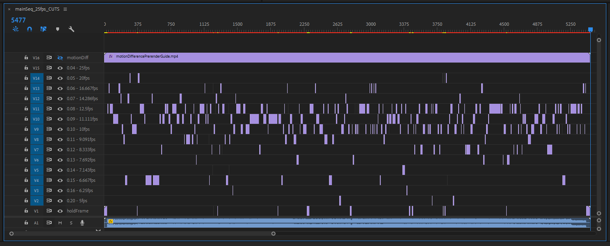
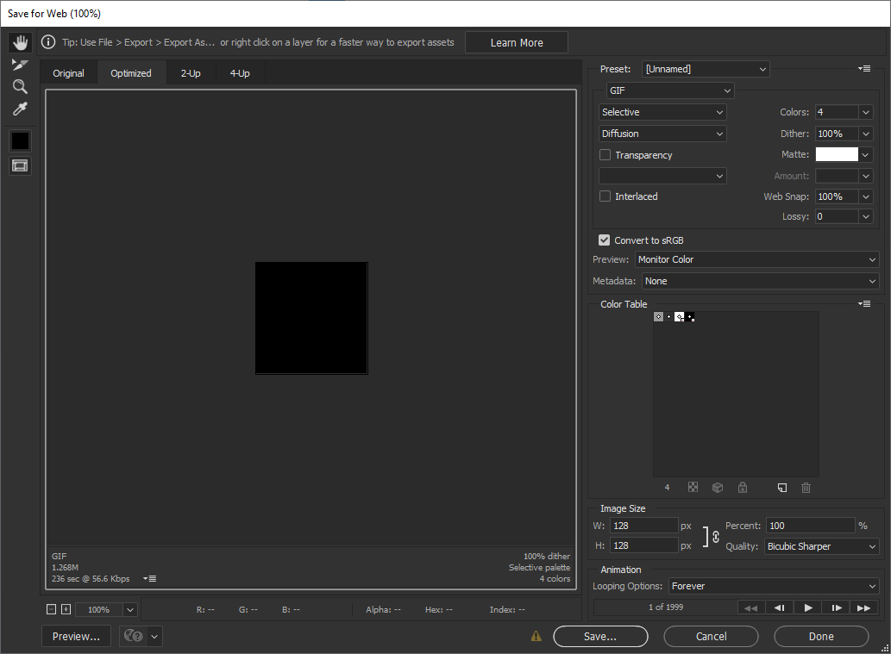

# Squeezing Bad Apple into a Discord Emote

file updates on the github repo:  
🔗 [https://github.com/STUAAAAAAAAAART/badappleDiscordEmote/](https://github.com/STUAAAAAAAAAART/badappleDiscordEmote/)

## preamble

previously, i've attempted to make a discord animated emote of Bad Apple, mostly as a curiosity to see if it'd work. this was done entirely in premiere (cropping and downsampling to a managable resolution) and photoshop (import the file with all its might, and compressing it to an animated GIF smaller than discord's size limits)

while it was possible to meet discord's expectations, discord did not play the back half of the GIF (and somehow it's bigger?)

so recently i've looked into the GIF that discord made, and turns out that it has lost all the frames from the back half. i did a lazy estimation and figured out that it stops around frame 2000 (just from matching the last frame on the discord GIF in the photoshop export file), and plans started manifesting from there.

## the intrusive thoughts

since the GIF standard allows for specifying the amount of time (in 0.01 seconds) any frame can appear for, it is possible to have a GIF animation with a variable framerate by assigning a frametime for each frame. sections in the video where it's all the same image for an amount of time can be represented as a single frame each with a long frametime (like in whole seconds. the GIF standard has no upper bound that would restrict this situation)

- doing this manually would be a nightmare

and the strategy to reduce the fame count down to about 2000 would revolve around deleting frames that does not make a meaningful difference from the previous frame (i.e. slow movements moving less than 1 pixel on a tiny image)

- doing this manually will introduce errors

maybe run farther with the variable framerate thing and give more frames for really fast motion?

- doing this manually will introduce errors and would be a nightmare

how about figuring out a way for animated motion smears for low framerate sections, to hide as much low-motion stutters as possible? maybe blend and merge multiple frames together?

- in photoshop, every frame is assigned a layer visibility list, in this case every frame has its layer. photoshop assumes a new layer is always visible to all the frames
- DOING THIS MANUALLY WOULD BE A NIGHTMARE

so, python.

### the working numbers

the known restrictions so far:
- max 128px square (i'm just going under this)
- under 256kb
- 2000 frames (discord emote playback cutoff)

the targets, along with the above:
- 0.08s nominal frametime (about 12.5fps)
- high motion sections target 0.05s to 0.07s
- low motion sections target from 0.09s to 0.16s and 0.20s
- hold frames for very low motion sections and freeze/solid frames
- motion smearing

source video:
- 480x360
- 30fps
- some frame blending / motion blur (not solid black/white)

the previous naiive attempt, as a reminder:
- converted entire video into a lower constant framerate
- result and issues:
	- 15fps video -> 14.29fps GIF, 24px square, 241KB
	- 15fps barely tolerable, 12fps past stretching point for most large motions
	- kinda small and pixelly (fine for reacts, really visible as full-sized emote)
	- photoshop had a 500-frame import limit
		- workaround: copy and insert frames from multiple open files
		- limit does not apply to opening animated GIFs
	- discord drops frames past frame #2000 

## figuring out the work

premiere pro:
- limited framerate options for sequences
	- workaround: make GIF of target "framerates" and force import
- still not ideal for a variable framerate workspace
	- at least `posterise time` filter makes a great preview and label for frame work later
photoshop:
- projects are limited to 500 frames
	- workaround: copy frames from other project and paste into main export project
- legacy GIF web preview and export is single-threaded and memory-intensive
	- nothing i can do but wait

python needs:
- figure out how to mark sections of the video in groups of target frametimes, and receive them
	- unfortunately this is done in premiere by way of cutting the video and cataloguing the cuts in a long multitrack sequence
	- after which, manually write the labels into a file, with the help of a python script that would write a neat JSON file
		- github repo file link
		- this is less of a nightmare
- parse the cuts and target frametimes and count the total number of GIF frames those would make
- edit target frametimes in-situ without editing the JSON file itself, to reduce frame count
	- there was a range of 0.05s to 0.16s and 0.20s in the list, but i was wary at this point of the process if anyone could feel the difference between neighbouring frametime values, so i've grouped some more of them to a common frametime.
- draw the rest of the owl and figure out the basic questions of:
	- how does one add two images together?
	- how does one multiply two images together?
	- how does one make an average of multiple frames together?
		- PIL, PIL, and PIL + numpy
- export the GIF sequence to bring into photoshop for the final compression
	- it's the fastest way i can get a filesize preview and the easiest way to get a visual while limiting the colour index, i think making a script to do this photoshop part would be a lot more work than i wanted. (i guess it'd be nice to actually make it if i want this step to run unattended in a server)
		- also PIL before photoshop. `Image.save()`
		- also also `Image.save()` requires frametime durations in milliseconds, not seconds, so quick step to multiply the units right before this...

other notes:
- there are transitions between black-is-object and white-is-object (sometimes even half and half)

  

- the first release played faster than the original video, due to rounding off frametime values per partial frame. this is fixed by getting a running sum of frametime lost to rounding, and adding 0.01s back to the actively processed frame whenever there's enough rounded time accumulated

## WIPs
[GITHUB: imgPreviewer.py](https://github.com/STUAAAAAAAAAART/badappleDiscordEmote/blob/main/source/imgPreviewer.py)  
[GITHUB: imgProcessor.py](https://github.com/STUAAAAAAAAAART/badappleDiscordEmote/blob/main/source/imgProcessor.py)

 
cuts in premiere and arrangement according to target frametime 
[GITHUB: cutFile.json](https://github.com/STUAAAAAAAAAART/badappleDiscordEmote/blob/main/source/cutFile.json)

 
final compression in photoshop, aiming to keep under 256KB

# Result

- 248KB
- variable framerates, nominally 12.5fps, fastest sections 16.66fps
- 1999 frames total
- 32px x 32px
- 4-colour web palette

so a couple observations:
- it's still pixely, but less so than the previous attempt because it's slightly larger in resolution now  
 (note difference in playback speed, this previous attempt had a constant frametime that does not match the intended framerate due to division and rounding)
- the very low frametime bits ar a bit jittery, a little noticable on the final GIF (this is where the previous attempt is better), but lowering frametime would mean going against the 2000-frame limit again
- high motion bits are a lot better than the previous attempt
- the bake from the python processor turned out kinda visually artifacty (add-sections have stray pixel outlines because of adding up h.264 compression artifacts in the intermediary frames), but those are mostly hidden away from the output file being so small

# what's next

while this was an exercise in making a GIF that better conforms to discord's limits, the use of abstracted image handling libraries give me a better sense on how to tackle large image management in a studio setting, for example if there is a need to optimise a set of images before passing on to the next workflow in the pipeline

so things like making a PNG to hold 6 channels' worth of data at half the bit depth is something i may have a better view on addressing (the logic in the function to average multiple frames together used numpy instead of a function in PIL, which opens up the possibility to directly write whatever i want per-pixel without having to wrestle too much with PIL image data formats)

<blockquote class="bluesky-embed" data-bluesky-uri="at://did:plc:inm5xqyx45i3cf4vdvcag37q/app.bsky.feed.post/3li7plvy4bk23" data-bluesky-cid="bafyreieg4s3lc7yfhzgoyjwjwqza5o6riuurupg4mdzfotrui7xkgqwa6q">
Been experimenting with MSDF files recently, a type of bitmap file that can approach the exactness of vector images. I&#x27;m working on reducing channels, unnecessary data, and trying to add multiple colours to what is currently just a mask#blender3D #cgart  <a href="https://bsky.app/profile/did:plc:inm5xqyx45i3cf4vdvcag37q/post/3li7plvy4bk23?ref_src=embed">[image or embed]</a>
&mdash; Dunda (<a href="https://bsky.app/profile/did:plc:inm5xqyx45i3cf4vdvcag37q?ref_src=embed">@dunda.bsky.social</a>) <a href="https://bsky.app/profile/did:plc:inm5xqyx45i3cf4vdvcag37q/post/3li7plvy4bk23?ref_src=embed">February 15, 2025 at 8:25 PM</a></blockquote>

 

<blockquote class="bluesky-embed" data-bluesky-uri="at://did:plc:7sy5eiua3tsdeuqc6gkzq7ew/app.bsky.feed.post/3lcypyixd7c2c" data-bluesky-cid="bafyreihplfjbw5bm2bhpq6eb223mmftaisd6az2opxcfudi3hgbr34lsbe">
So the pack is straight forward right, take the 3 channels, shift them down into their 8 bit chunks, and pack them into an int. 

Unpacking you just do the reverse - and this appears to work VERY well actually ...

But the question is - HOW do we pack the source image? What tools can pack bitwisely?
&mdash; Sepha3D (<a href="https://bsky.app/profile/did:plc:7sy5eiua3tsdeuqc6gkzq7ew?ref_src=embed">@sepha3d.bsky.social</a>) <a href="https://bsky.app/profile/did:plc:7sy5eiua3tsdeuqc6gkzq7ew/post/3lcypyixd7c2c?ref_src=embed">December 11, 2024 at 10:38 AM</a></blockquote>

as for the use of OpenCV in this project, i've yet to actually break the surface of openCV, but would be nice to finally start considering curiosity projects like 3D scanning and mocap

finally, the GIF standard is extremely old, but using video codecs to replace GIFs would require figuring out when to tell the OS or app that the media is to be treated like an image, and when to treat it like a video (imagine a "GIF" with a video slider, or the OS refusing to go into display sleep because a "GIF" video is playing). as it stands, gif processing knowledge would still be nice as long as it's favoured in small places

### thanks
to the folk over at Freya Holmer's discord server: Kenzie was interested to see this work; Dunda was a general-technical inspiration from their current projects

and to the most in the server who appreciates emotes as a means of adding expression to otherwise unaccented messages that could be taken dryly